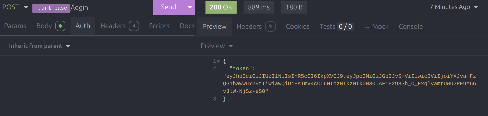
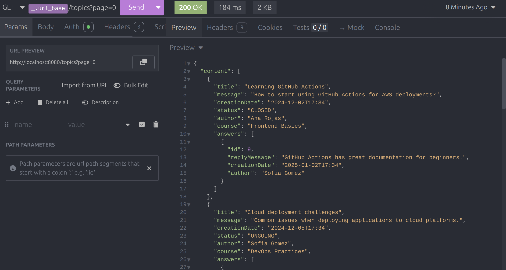
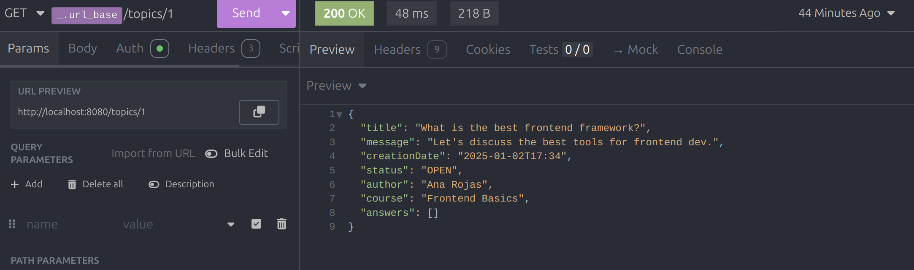
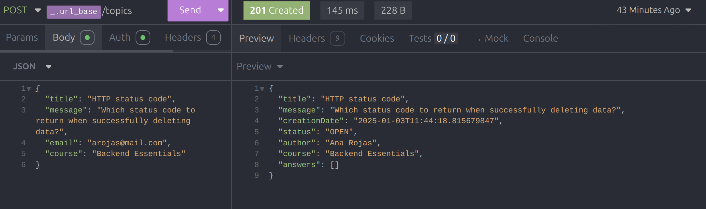
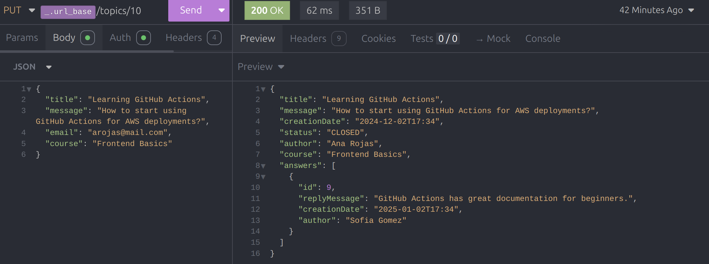
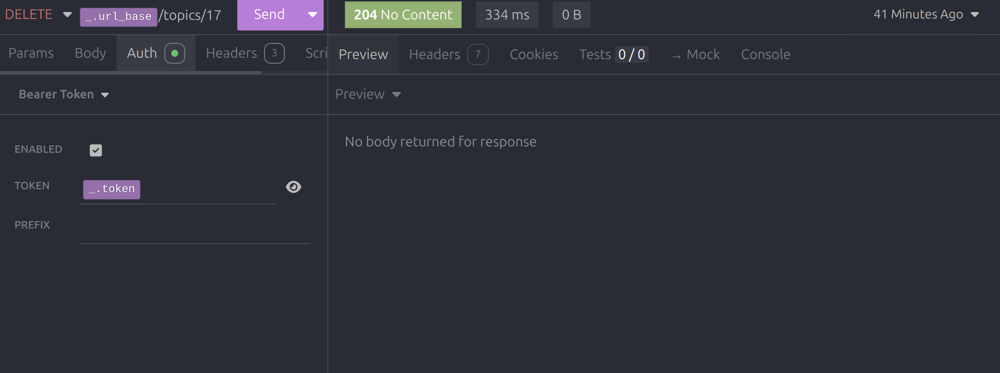
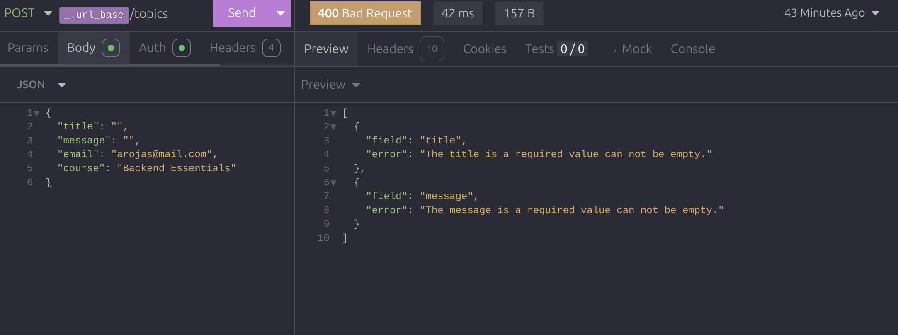
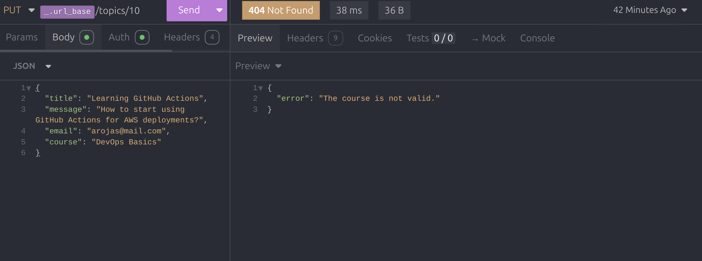

# ForoHub

## Table of Contents
- [About the Project](#about-the-project)
- [Built With](#built-with)
- [Getting Started](#getting-started)
    - [Prerequisites](#prerequisites)
    - [Installation](#installation)
- [Usage](#usage)
- [Examples](#examples)

---

## About the Project
<div align="center" padding="20">

</div>
<b>ForoHub</b> is a REST API designed to manage discussion forums through CRUD operations, with support for 
authentication and authorization. The application is developed with Spring Boot.

### Main Features:
- User authentication with JWT.
- Full management of forum topics (create, read, update, and delete).
- Security implementation with Spring Security.
- Automatic database migrations with Flyway.
- API documentation with Springdoc.
- JSON serialization/deserialization with Jackson.
- Simplified code with Lombok.

---

## Built With

- **Spring Boot**: Framework for robust Java application development.
- **Spring Security**: Handles authentication and authorization.
- **JWT (JSON Web Tokens)**: Token-based authentication.
- **Flyway**: Database migrations.
- **MySQL**: Relational database.
- **JPA**: Database query abstraction.
- **Lombok**: Simplifies boilerplate code.
- **Springdoc**: Automatically generates OpenAPI documentation.
- **Insomnia**: API testing client.

---

## Getting Started

### Prerequisites

Ensure you have the following installed:
- Java Development Kit (JDK) 17 or higher.
- Maven for dependency management.
- MySQL configured and running locally.
- Insomnia or Postman to test the API.

### Installation

1. Clone the repository and install dependencies:
   ```bash
   git clone https://github.com/abengl/ForoHub.git
   cd Forohub
   mvn install
   ```

2. Configure your MySQL database credentials in the `application.properties` file:
   ```properties
   spring.datasource.url=jdbc:mysql://localhost:3306/foro_db
   spring.datasource.username=your_username
   spring.datasource.password=your_password
   ```

3. Start the application:
   ```bash
   mvn spring-boot:run
   ```

---

## Usage

### Main Endpoints

- **POST /login**: Authenticates a user and generates a JWT.
- **GET /topics**: Retrieves a paginated list of topics.
- **GET /topics/{id}**: Retrieves a specific topic by its ID.
- **POST /topics**: Creates a new topic (requires authentication).
- **PUT /topics/{id}**: Updates an existing topic (requires authentication).
- **DELETE /topics/{id}**: Deletes an existing topic (requires authentication).

---

## Examples

### Authenticate a User


### Obtain All Topics or By Topic ID



### Create a New Topic or Update a Topic



### Delete a Topic By ID


### Error Handling




